從上個月的 8/9 開始，我的每日5公里晨跑計劃進入了起步階段。現在快要一個月過去了。一起來看看這個月的數據。

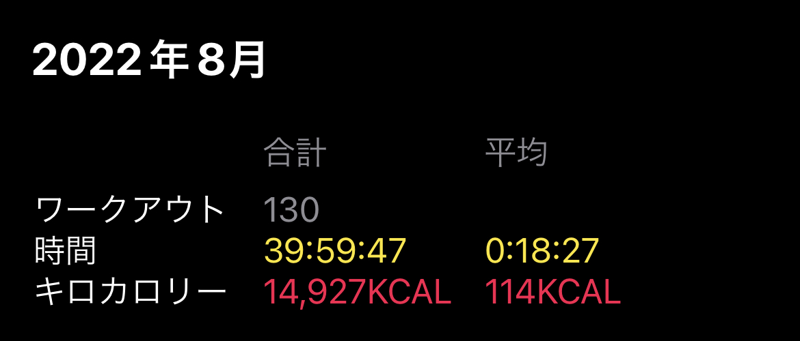

- 整個月一共進行130次“運動”，平均每次18分鐘，一共消耗 14927 kcal，平均每次“運動”的消耗是 114 kcal

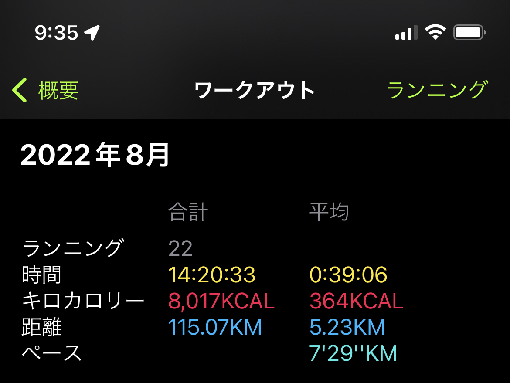

- 限定到跑步的話有22次晨跑，合計14小時20分鐘33秒，平均每次39分鐘6秒。
- 總距離 115.07 km，每次5.23公里。總體達到每次5公里以上的目標。
- 平均配速 7分29秒。由於是長時間沒有運動，所以並未對配速有太多的自我期望。能跑完就不錯了。

然後就是令人尷尬的體重數據，其實長時間以來自己都是把腦袋埋在土裏的鴕鳥，避免談論和直視自己的身體狀態。

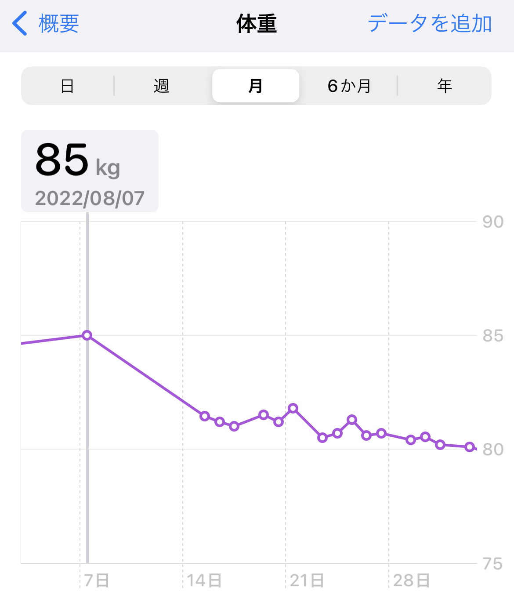

這裏把2021年時最重的體重放在最高點，當時有85kg左右，且有脂肪肝。今年6月的體檢時也一樣有脂肪肝，體重基本上接近85公斤。
中間感覺好像體重有減輕。主要應該是因爲之前沒有跑步而是對着電視機上的YouTube視頻練習HIIT。

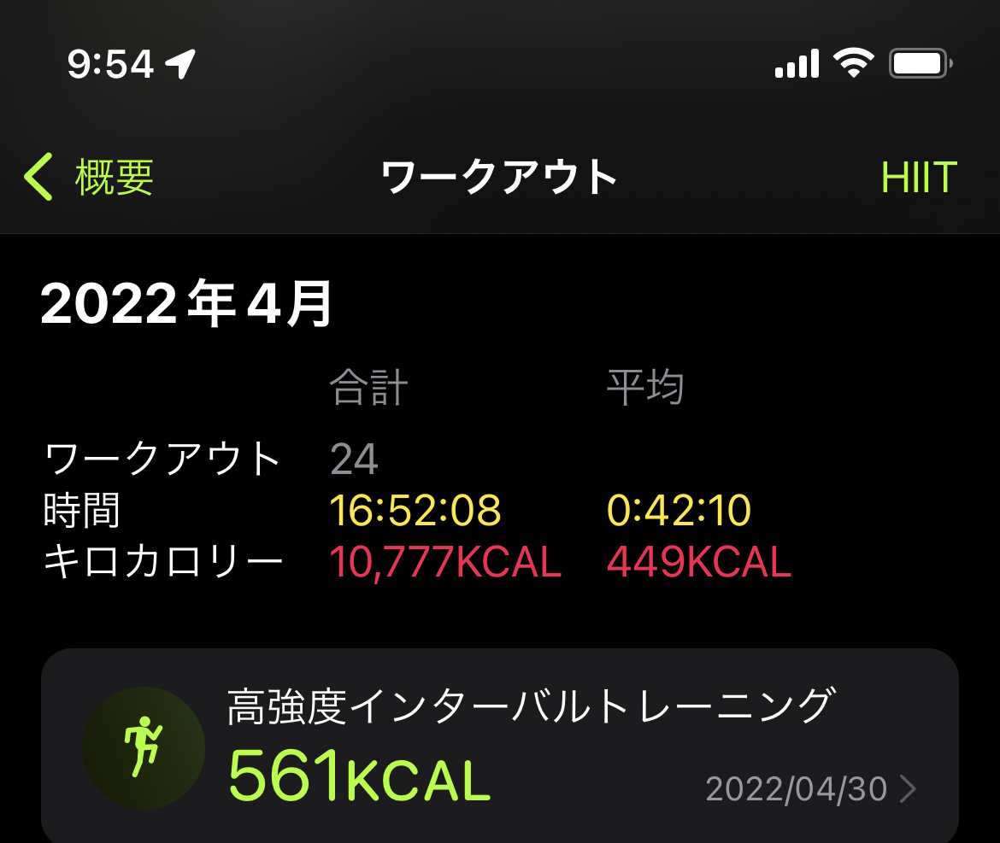
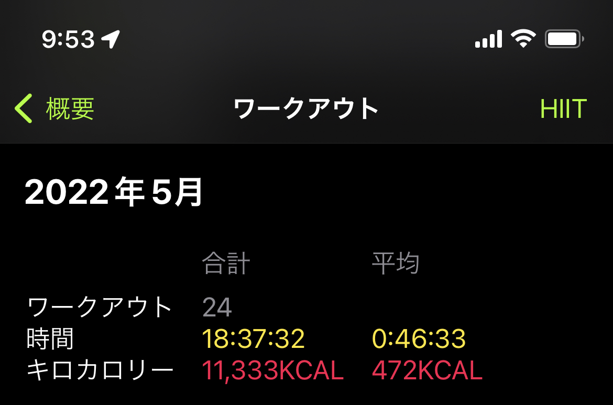
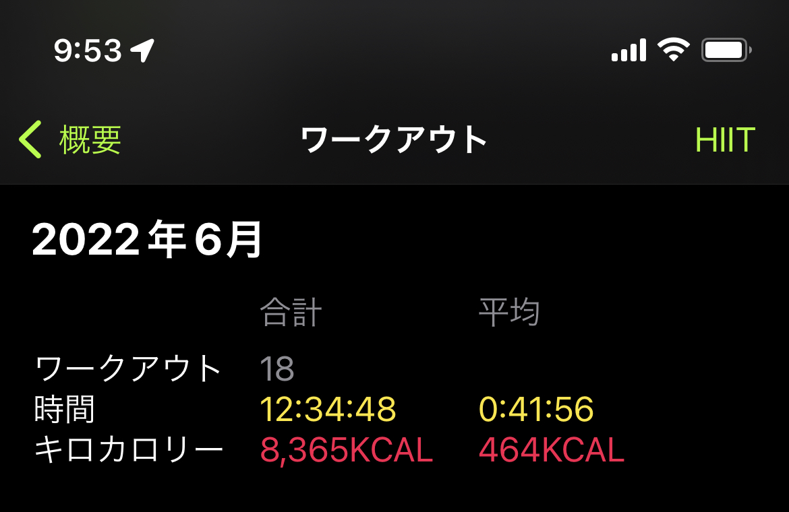
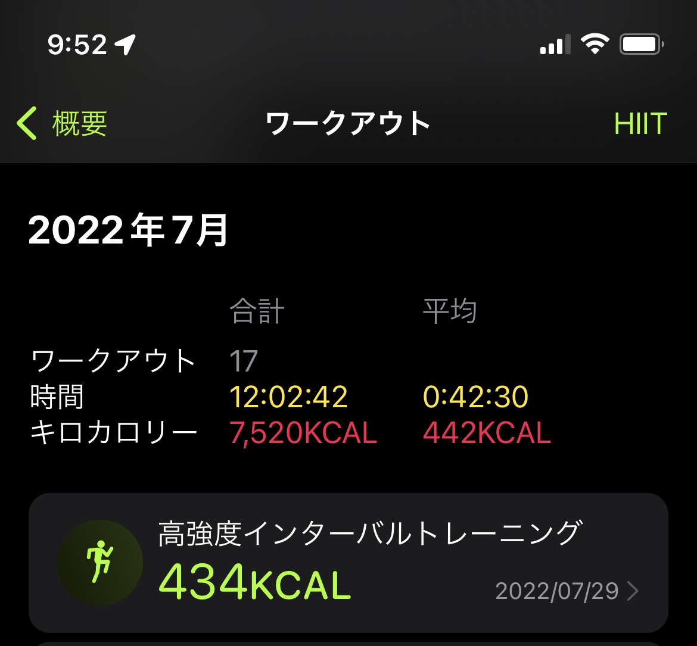
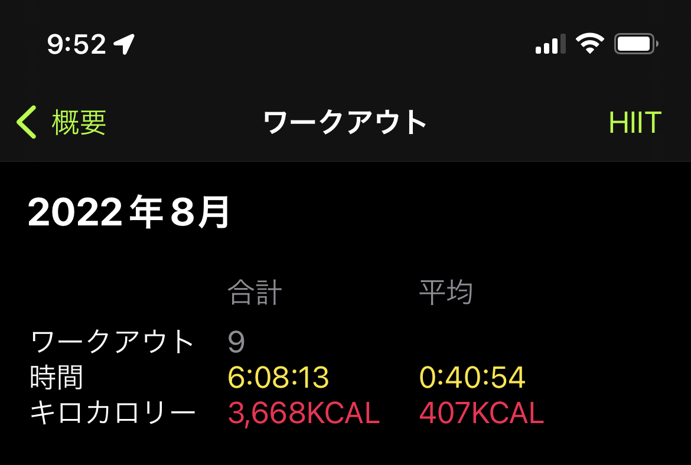

但是總體感覺HIIT的練習雖然也能流汗，蘋果手錶的測量可能有誇大的成分。
現在9/4上午的體重數據是 

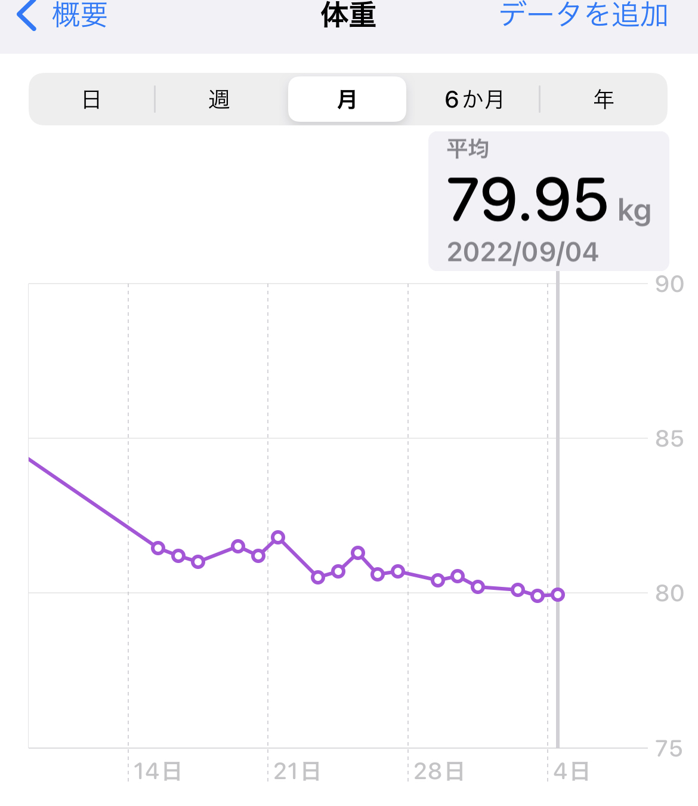

9月秋天的氣溫比起8月涼爽很多，也許能多跑一點。
今天的距離是7.5公里。

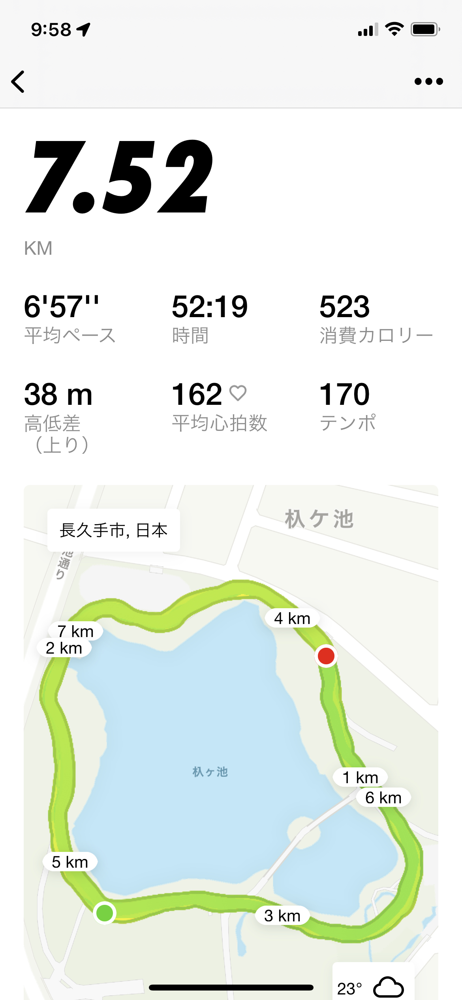
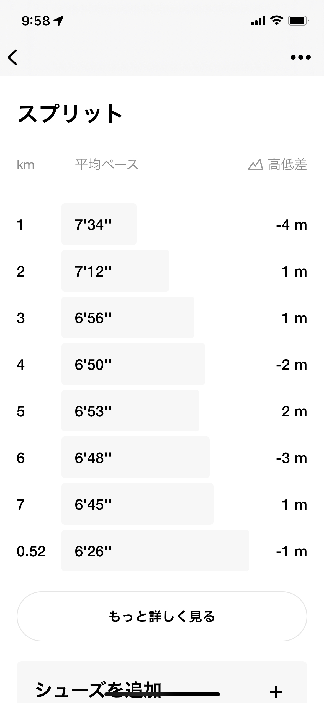

跑完心情舒暢。精神感覺非常好。堅持下去。年底能否實現體重75kg，也就是相對最高體重時減輕10kg。拭目以待。

