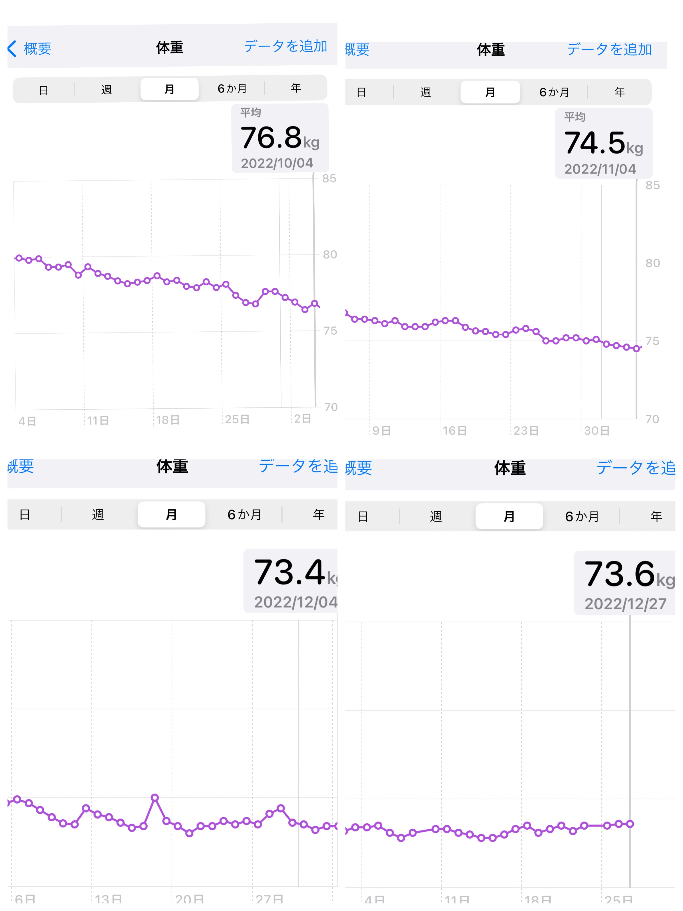
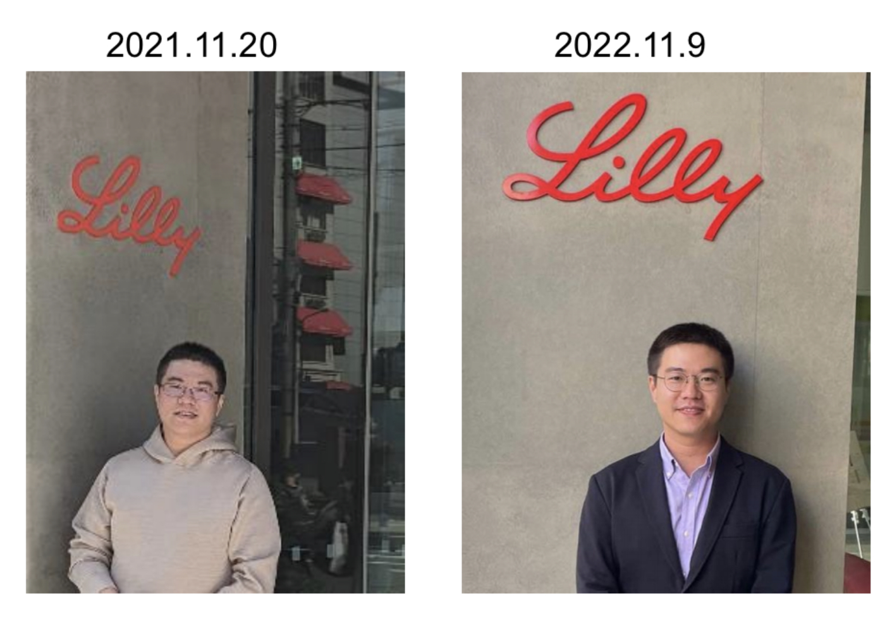

到了年底當然要來報告一下8月份開始跑步的結果。封面的柱狀圖是四個月的跑步累計成績。雖然還有幾天才到2023，目前爲止累計的跑步次數是139次，平均速度每公里用時6分14秒，總體跑步時長129小時，總里程1241km。

封面圖也能看出我的跑步成績在12月比11月份是下降的，速度和每次的平均距離都呈現退步。主要是因爲12月的天氣實在是太冷了吧。12月24日這天還下了大雪停止了跑步訓練。即便是能早起出去跑步，室外氣溫低於5度時前面3-4公里的速度基本上沒辦法和11月時相比較。1月2月估計室外的溫度依然會是寒冷持續，希望自己不要半途而廢。雖然沒有計劃參加什麼馬拉松之類的，只是不想因爲天冷把每天運動的時間給減少了。

當然比跑步累計里程，更加令人期待的結果公佈就是體重的變化了。直接上每日稱重數據變化曲線圖。

上次的9月4日時是79.95 kg。然後10月4日降到 76.8 kg (-3.15 kg)，11月4日降到 74.5 kg (-2.3 kg)，12月4日降到 73.4 kg (-1.1 kg)，到今天73.6 kg。12月體重基本上維持在73-74之間浮動，沒有顯著變化。超過了預期的總體減重10 kg（至75kg以下）的目標。降到75kg並維持低於這個體重的日子是 11月7日。所以11月4日的數據雖然低於了75公斤卻又回升直到幾天過後才真正維持住。12月的跑步成績不佳，加上每天因爲時常感到很餓而不計較地攝入堅果類和餅乾類零食。。。導致事實上攝入能量和支出的能量消耗達到了平衡。

2023年仍然計劃繼續跑步。天氣快點暖起來吧。

