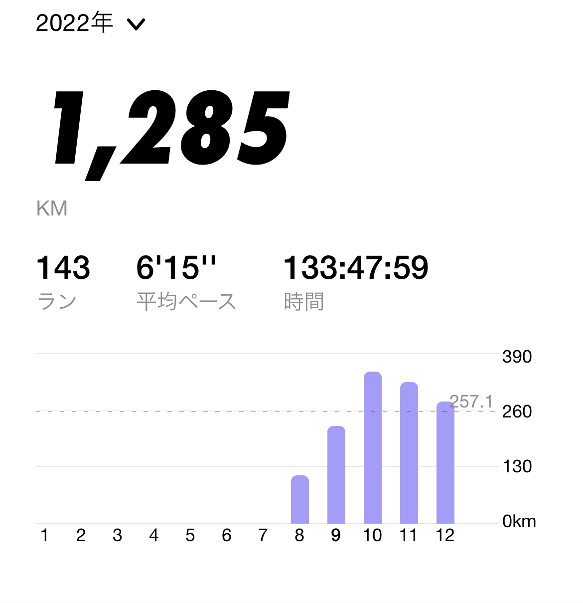
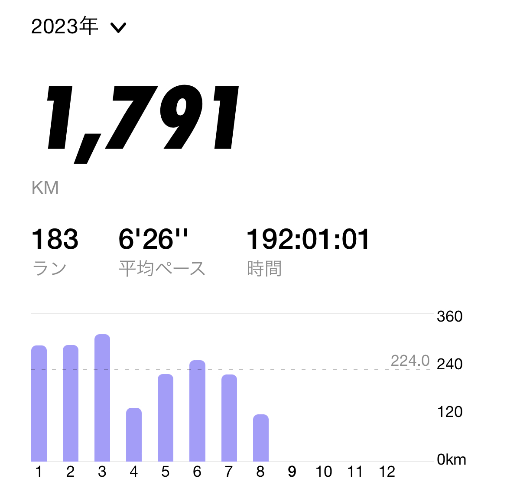
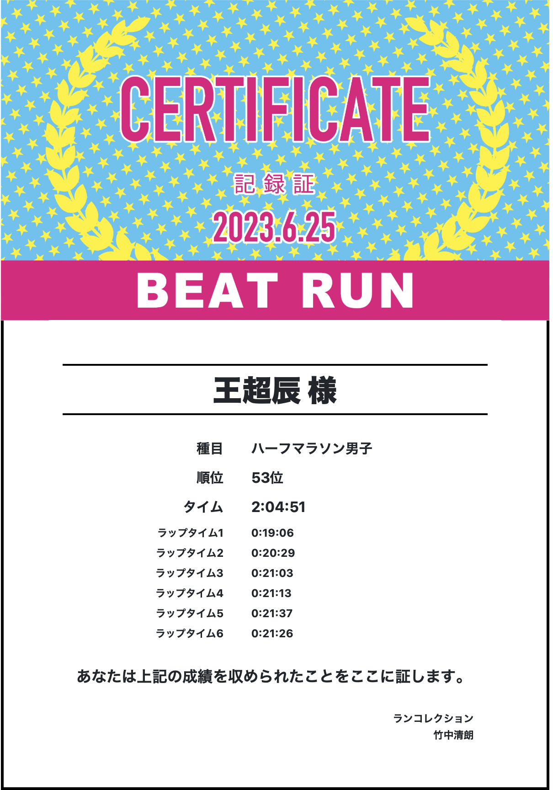
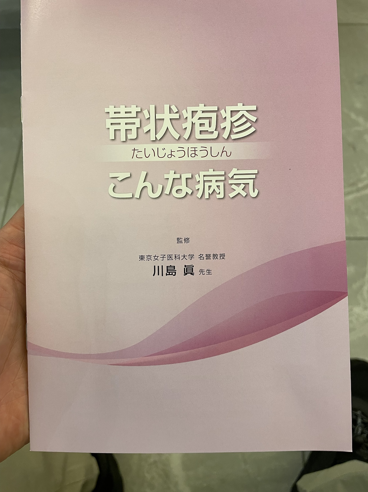
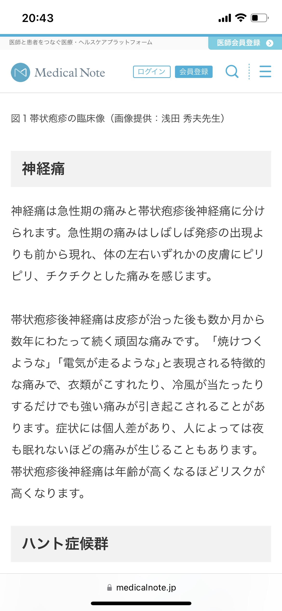
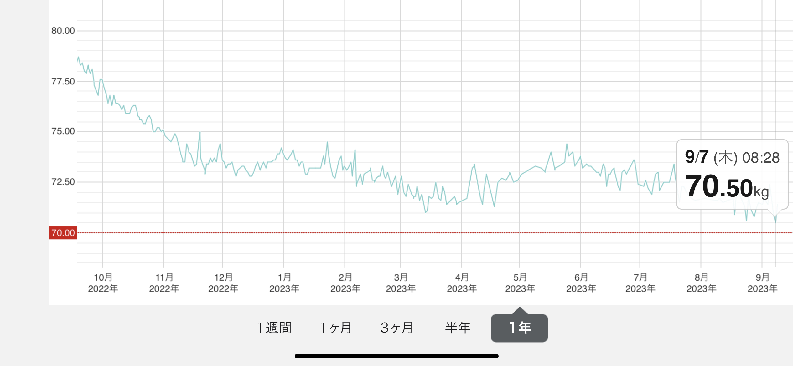

從去年8月開始到今年的8月底，我算是完整的完成了一年的跑步目標。
現在就來進行一下彙總和反思。

充實的一年讓人感慨萬千，雖然一開始就知道這是不容易的事。
無論是晴天還是雨天，甚至是寒冷的冬天，我沒有放棄過。

## 2022年8月至12月跑了1285 km

## 2023年至8月完成了1791 + 95 = 1886 km

8月的數據蘋果手錶只收集到了17日左右。18日開始換成了 Pixel Watch。好多天不太懂怎麼記錄。
大概是18日開始一日 5 km 一日10 km的節奏，姑且算是 7個5 km + 6個10km約 95km的距離。
算下來365天，平均每天8.68 km左右。

## 第一個半程馬拉松

6月生日這天，我選擇報名馬拉松來度過一個特別的生日。我充滿了期待，用盡了力氣，全情投入，沒有半途而廢，創造自己的個人記錄（2小时4分钟51秒）。
    
這次半馬的經歷不會是最後一次參加馬拉松，我希望今後還有更加實質的突破。

## 帶狀皰疹 
3月底的時候，突然感覺身體有異樣，去診所一檢查，竟然是帶狀皰疹。原因是過度疲勞了。經歷過的人一定有所體會，那種像電流一樣突然穿透全身的神經疼痛是我這輩子從未感覺過的奇怪體驗。醫生說有的人會有很長時間的神經痛後遺症。所幸自己並沒有。這是一段非常不愉快的時光。身體在適當的時候會發出信號，何時需要休息。大概一個月左右，堅持服用抗病毒藥，終於克服，四月也是今年跑量最少的一個月，

## 體重降低

最顯著的變化當然要說的是體重了。
從最高時期的接近85kg (難以置信吧) 到如今維持在70上下，這是一條看起來十分美好又充滿了汗水的曲線。
其實這曲線就在兩個月前的5月中下旬還曾經返回到接近74kg左右，一度有懷疑是否是身體已經適應了跑步的消耗。
幸好6月之後調整了作息和節奏，改成一天10km，一天5km左右的距離。維持了斜率繼續爲負數的傾向。
燒掉了將近15公斤的多餘脂肪（可能也有一些肌肉損失），這是一個暢快但艱難的過程，如今BMI終於來到了正常範圍之內。不過這不是終點，還需要繼續堅持。最開心的是以前的衣服又能穿上了（幸好沒有安心做個胖子把瘦的衣服都扔掉）。

## 展望

接下來我覺得每隔半年需要參加一次馬拉松，以維持身體和腳步的感覺。11月26日，我報名了另一個半程。期待再次穿過起點線，用堅持不懈和毅力，當然還希望保持輕鬆的心情，把這當作一件理所當然的過程和經歷。